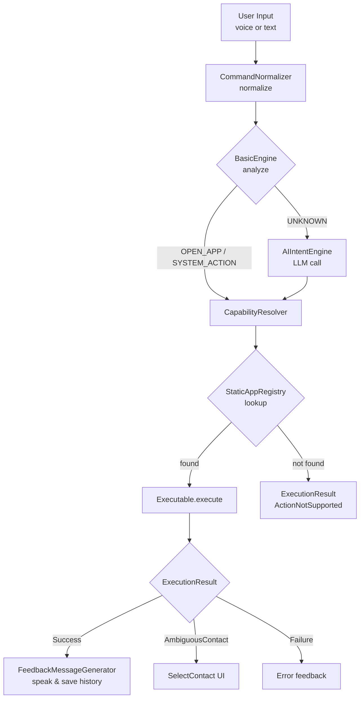
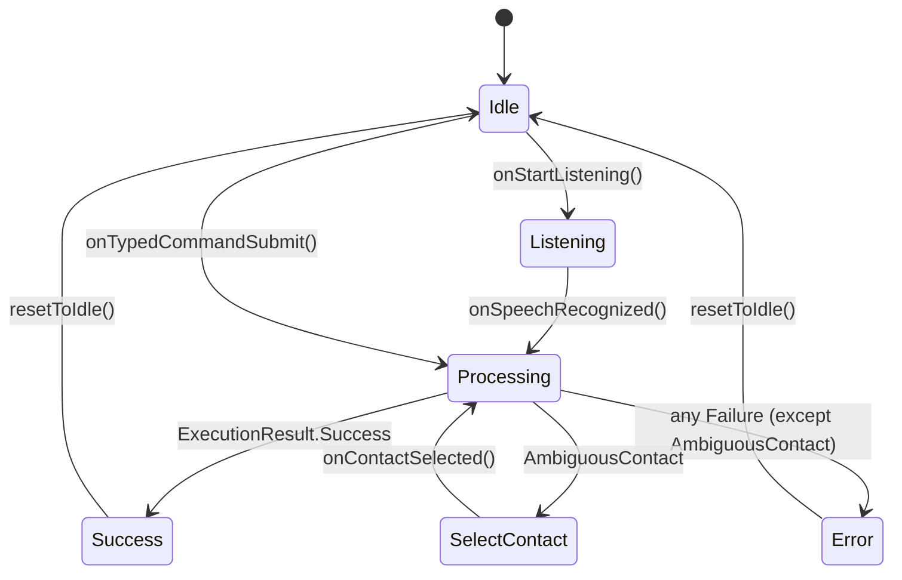

# Architecture

## Pattern

Chhotu uses **MVVM (Model-View-ViewModel)** combined with **Clean Architecture** layering. The UI layer knows only about ViewModels; ViewModels know only about use cases and repositories; domain logic has zero Android framework dependencies (except where platform abstractions are injected).

---

## Layer Breakdown

```
┌──────────────────────────────────────────┐
│                   ui/                    │  ← Compose screens, ViewModels
├──────────────────────────────────────────┤
│              domain/ + execution/        │  ← Pure Kotlin business logic
├──────────────────────────────────────────┤
│                  data/                   │  ← Android implementations, I/O
├──────────────────────────────────────────┤
│                  speech/                 │  ← STT + TTS (Android-specific)
└──────────────────────────────────────────┘
```

### `ui/`
- Jetpack Compose screens (`AssistantScreen`, `SettingsScreen`)
- `AssistantViewModel` — owns `AssistantState` StateFlow; drives all user-visible transitions
- `SettingsViewModel` — manages theme and speech language preferences
- `AppNavGraph` — Navigation Compose graph wiring
- `MainActivity` — single activity; hosts the nav graph and handles runtime permissions

### `domain/`
- **Engine layer** (`domain/engine/`): intent parsing
  - `CommandNormalizer` — lowercases, trims, strips punctuation
  - `BasicEngine` — token-based rule matching (`open`, `launch`, `call`, …)
  - `AIIntentEngine` — LLM call fallback; produces `StructuredIntent`
  - `CapabilityResolver` — looks up `StaticAppRegistry`, dispatches to the right `Executable`
  - `ContactManager` — queries contacts, handles disambiguation
- **Registry layer** (`domain/registry/`): app knowledge base
  - `StaticAppRegistry` — 60+ `RegistryEntry` objects, each with `Action` sets and `Executable` strategies
  - `Executable` interface + five implementations
- **Use cases** (`domain/usecase/`):
  - `ExecuteVoiceCommandUseCase` — composes normalizer → engines → resolver into one `suspend fun execute()`
  - `FeedbackMessageGenerator` — maps `CommandResult` → human-readable TTS string
- **Platform interfaces** (`domain/platform/`): `IntentLauncher`, `AppInstallationChecker`, `SystemServiceProvider` — keep executables testable without Android

### `data/`
- `LLMService` — Retrofit interface for `/v1/chat/completions`
- `AppDataStore` — generic DataStore wrapper; all keys declared as constants
- `SettingsRepository` — theme mode, onboarding flag, speech language
- `CommandHistoryRepository` — persists/retrieves command history (JSON-serialized via DataStore)
- `ContactRepositoryImpl` — content-provider queries for contacts
- `data/platform/` — Android implementations of domain platform interfaces

### `execution/`
- `CommandExecutor` — thin `@Singleton` facade over `ExecuteVoiceCommandUseCase`; preserved for backward compatibility

### `speech/`
- `SpeechInputManager` — wraps `android.speech.SpeechRecognizer`; exposes callbacks
- `TTSFeedbackManager` — wraps `android.speech.tts.TextToSpeech`; provides `speak()`

### `di/`
- `AppModule` — `@Provides` singletons: Retrofit, OkHttp, Gson, DataStore, TTS, STT
- `RegistryModule` — `@Binds` for interface → implementation pairs (`AppRegistry → StaticAppRegistry`, platform interfaces → Android implementations, engines via `@Named`)

---

## Command Processing Pipeline



---

## Intent Model

`StructuredIntent` is the lingua franca between engines and the resolver:

```kotlin
data class StructuredIntent(
    val intentType: IntentType,     // OPEN_APP | APP_ACTION | SYSTEM_ACTION | UNKNOWN
    val targetApp: String?,         // e.g. "WhatsApp", "Spotify"
    val action: String?,            // e.g. "search", "call", "turn on"
    val entities: Map<String, String>, // e.g. { "query": "Bakhuda", "contact": "John" }
    val confidence: Double          // 0.0–1.0; < 0.6 triggers fallback
)
```

---

## Executable Strategy Pattern

`CapabilityResolver` selects an `Executable` based on the `Action` registered in `StaticAppRegistry`:

| Executable | When used |
|---|---|
| `IntentExecutable` | Standard `Intent` (open app, open URL) |
| `SystemExecutable` | Intents requiring contact/phone URI resolution (call, SMS) |
| `DeepLinkExecutable` | Deep links with `{placeholder}` interpolation |
| `VolumeExecutable` | `AudioManager` volume control |
| `FlashlightExecutable` | `CameraManager` torch control |

Each `Action` can declare a `primaryExecutable` and an optional `fallbackExecutable` (e.g., deep link → Play Store if app not installed).

---

## UI State Machine

`AssistantState` is a sealed class; `AssistantViewModel` drives the Compose UI reactively:



---

## Dependency Injection

Hilt's `SingletonComponent` hosts all long-lived dependencies. Key wiring:

```kotlin
// AppModule.kt
@Provides @Singleton fun provideLLMService(retrofit: Retrofit): LLMService

// RegistryModule.kt
@Binds @Named("basic") fun bindBasicEngine(impl: BasicEngine): EngineInterface
@Binds @Named("ai")    fun bindAIEngine(impl: AIIntentEngine): EngineInterface
@Binds fun bindAppRegistry(impl: StaticAppRegistry): AppRegistry
@Binds fun bindIntentLauncher(impl: AndroidIntentLauncher): IntentLauncher
```

`@HiltViewModel` is used for all ViewModels.
