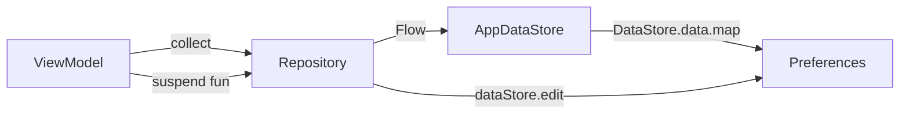

# Database & Local Storage

Chhotu uses **DataStore Preferences** as its sole local persistence mechanism. There is no Room database in the current implementation — Room is declared as a dependency but DataStore is used for all persistence.

---

## DataStore

### `AppDataStore`

A generic singleton wrapper around `DataStore<Preferences>` that centralises all key definitions:

```kotlin
companion object Keys {
    val COMMAND_HISTORY      = stringPreferencesKey("command_history")
    val THEME_MODE           = stringPreferencesKey("theme_mode")
    val ONBOARDING_COMPLETED = stringPreferencesKey("onboarding_completed")
    val SPEECH_LANGUAGE      = stringPreferencesKey("speech_language")
}
```

All values are stored as `String`. The DataStore instance is created via the `preferencesDataStore` delegate and named `"app_prefs"`.

---

## Persisted Data

### Command History

**Key:** `command_history`
**Managed by:** `CommandHistoryRepository`

History items are serialised to JSON and stored as a single string value. The repository exposes a `Flow<List<CommandHistoryItem>>` that emits on every change.

```kotlin
data class CommandHistoryItem(
    val originalText: String,       // Raw user input
    val intentType: String,         // Descriptive label (e.g. "AI Command")
    val wasSuccessful: Boolean,
    val feedbackMessage: String,    // TTS string that was spoken
    val timestamp: Long             // System.currentTimeMillis()
)
```

Operations:
- `addItem(item)` — prepend to list and persist
- `removeItem(item)` — filter out and persist
- `history: Flow<List<CommandHistoryItem>>` — live stream

### Theme Mode

**Key:** `theme_mode`
**Managed by:** `SettingsRepository`
**Values:** `"LIGHT"`, `"DARK"`, `"SYSTEM"` (enum name)
**Default:** `"SYSTEM"`

```kotlin
val themeMode: Flow<ThemeMode> = appDataStore
    .getStringFlow(AppDataStore.THEME_MODE, ThemeMode.SYSTEM.name)
    .map { runCatching { ThemeMode.valueOf(it) }.getOrDefault(ThemeMode.SYSTEM) }
```

### Onboarding Completed

**Key:** `onboarding_completed`
**Managed by:** `SettingsRepository`
**Values:** `"true"` / `"false"`
**Default:** `"false"`

Set once via `setOnboardingCompleted()` and never reset (unless the app data is cleared).

### Speech Language

**Key:** `speech_language`
**Managed by:** `SettingsRepository`
**Default:** `"System default"`

Stores the user's selected STT locale string as a human-readable label.

---

## Data Flow



All reads return `Flow` (reactive); all writes are `suspend fun` safe for `Dispatchers.IO`.

---

## Notes on Room

Room is declared in `build.gradle` and `libs.versions.toml` but is not actively used. It may be intended for a future migration if history or contact caching requires relational queries.
